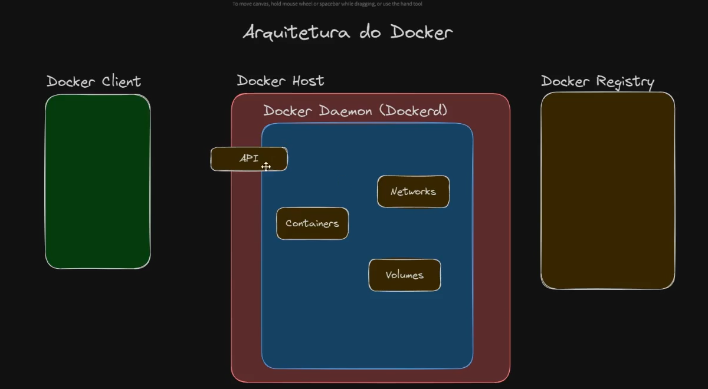

# Docker API  and SDK




## docker.socket

Para te explicar o que é o `docker.socket`, vamos começar com uma analogia.

Imagine que você tem um restaurante (o **Docker Daemon**, que é o "cérebro" do Docker). Esse restaurante tem uma cozinha, chefs, garçons e tudo mais. Agora, imagine que você quer fazer um pedido. Você não entra na cozinha para falar com o chef, certo? Você vai até a entrada, onde há uma janela para fazer pedidos.

Essa janela é o **`docker.socket`**.

O `docker.socket` é um arquivo especial que funciona como um **ponto de comunicação**. Ele permite que outros programas (como a interface de linha de comando do Docker, o `docker CLI`) enviem comandos para o Docker Daemon. Em vez de se comunicarem diretamente com o "cérebro" do Docker, eles mandam as requisições para essa "janela".

---

### Resumindo:

* **Docker Daemon:** O serviço principal do Docker, o "cérebro" que gerencia os contêineres, imagens, etc.
* **`docker.socket`:** A porta de entrada para se comunicar com o Docker Daemon. Ele funciona como uma "janela de pedidos" segura e organizada.
* **`docker CLI` (o comando `docker` que você usa no terminal):** O "cliente" que envia os pedidos para a `docker.socket`, que por sua vez os repassa para o Docker Daemon.

Quando você digita um comando como `docker run hello-world`, o que acontece é:

1.  O `docker CLI` pega seu comando.
2.  Ele envia esse comando para a `docker.socket`.
3.  A `docker.socket` entrega o pedido para o Docker Daemon.
4.  O Docker Daemon executa o comando, cria o contêiner, etc.
5.  O Docker Daemon envia a resposta de volta pela `docker.socket` para o `docker CLI`, que mostra a resposta para você no terminal.

É por isso que, para usar o Docker, o serviço do `docker.socket` precisa estar ativo e você precisa ter permissão para acessá-lo. Ele é o elo de ligação entre você e a "magia" que acontece nos bastidores.

# SDK

[SDK Docker languages](https://docs.docker.com/engine/api/sdk/)

## Python Ubuntu

To install Python on Ubuntu using the command line, follow these steps:

1. **Update package lists** (recommended before installing new software):

```bash
sudo apt update
```

2. **Install Python** (Ubuntu usually ships with Python 3 by default, but you can install or upgrade it):

```bash
sudo apt install python3
```

3. **Verify the installation**:

```bash
python3 --version
```

You should see the installed version (e.g., `Python 3.12.x`).

---

### (Optional) Install `pip` (Python package manager)

If you also want `pip` to manage Python packages:

```bash
sudo apt install python3-pip
pip3 --version
```

---

Would you like me to include steps to install **multiple versions of Python** (using `deadsnakes PPA`) so you can switch between them?


Ah, I see what's happening — you’re running into **Ubuntu’s new "externally-managed-environment" restriction** (introduced in Ubuntu 23.04+ with Python 3.11+).

This prevents `pip` from installing Python packages **system-wide** to avoid breaking system packages that rely on Python.

Here’s how to work around it safely:

---

## ✅ Recommended Way: Use `python3 -m venv` (No Need for `virtualenv`)

Since Ubuntu recommends avoiding global pip installs, you can just use the **built-in venv module** (no extra installation needed):

```bash
# Make sure you have full Python installation
sudo apt install python3-full

# Create a virtual environment
python3 -m venv myenv

# Activate it
source myenv/bin/activate

# Upgrade pip inside the venv
pip install --upgrade pip
```

Now you can install anything inside this virtual environment without errors:

```bash
pip install requests
```

---

## 🔧 Option 2: Install `virtualenv` via `apt`

If you specifically want `virtualenv` (not just venv):

```bash
sudo apt update
sudo apt install virtualenv
```

Then use it:

```bash
virtualenv myenv
source myenv/bin/activate
```

---

## ⚠️ Option 3: Force System-Wide Install (Not Recommended)

If you **really** want to install `virtualenv` globally via pip (not recommended on Ubuntu), you can override the restriction:

```bash
pip3 install virtualenv --break-system-packages
```

But this can break system tools — use this only if you know what you're doing.

---

✅ **Best practice:** Use `python3 -m venv` (Option 1). It’s safer, built-in, and avoids Ubuntu’s restriction entirely.

---

Would you like me to show you **how to use `pipx`** to install tools like `virtualenv` globally but safely (without affecting system Python)?


# Database
   
 https://virtualenv.pypa.io/en/latest/#