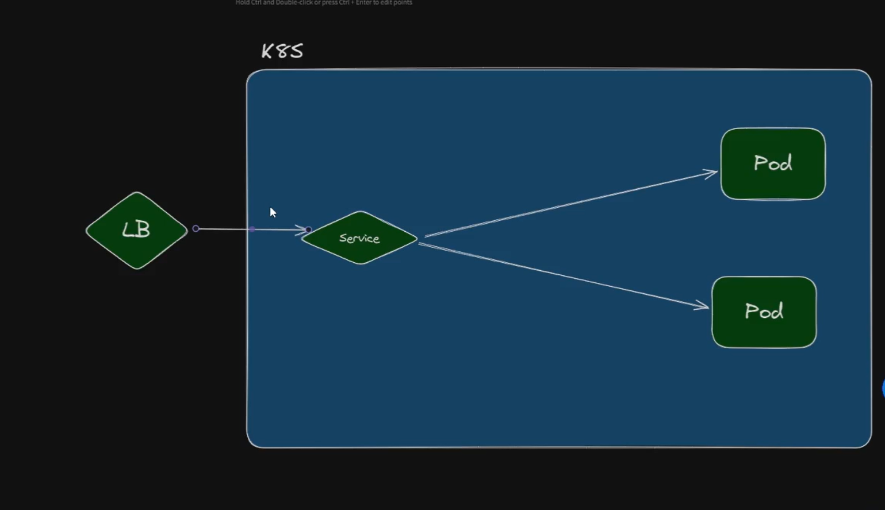
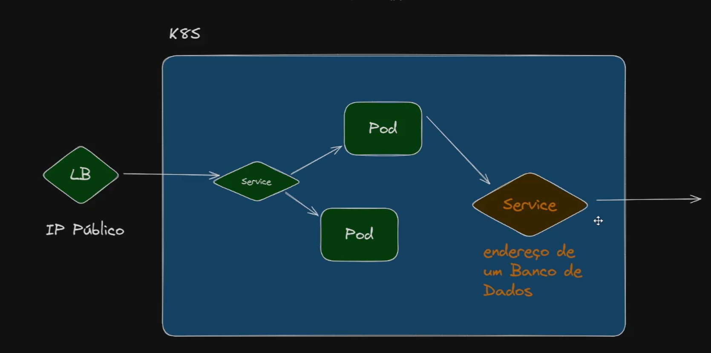

# Services

A **Service** in Kubernetes is a way to give your set of application pods a **single, stable network address** and port. 🌐 Think of it as a permanent post office box or a receptionist for your application, even though the actual workers (your pods) are constantly changing.

***

### Why Do You Need a Service?

Your application in Kubernetes is run inside **Pods**.

1.  **Pods are temporary:** They can be created, killed, and replaced at any time (e.g., when you roll out an update or if a node fails).
2.  **Pods have temporary IP addresses:** Every time a pod is created, it gets a new IP address.

If you have another part of your application (like a front-end) that needs to talk to a set of back-end pods, it can't rely on their temporary IP addresses. It needs a reliable, fixed address.

**This is what the Service provides.**

***

### How It Works (The Analogy)

Imagine you have a popular pizza shop 🍕.

| Kubernetes Term | Real-World Analogy | Explanation |
| :--- | :--- | :--- |
| **Pod** | A specific pizza chef | The actual running instance of your app. They can take a break (die) or be replaced by a new chef (new pod). |
| **Deployment** | The Manager of the chefs | Ensures the right number of chefs are always working. |
| **Service** | The **Main Phone Number** | The stable, fixed number for the shop. It doesn't matter which chef answers, the number is always the same. |
| **Selector** | A sign that says "All chefs wearing red hats" | The rule that the Service uses to figure out *which* pods (chefs) belong to it. |

When a customer (another application) calls the main phone number (the **Service**), the call is automatically routed to an available chef (a **Pod**). The customer never needs to know the chef's personal phone number (the Pod's IP).

***

### Key Types of Services

Kubernetes offers a few common ways to expose your application, depending on who you want to reach it:

1.  **ClusterIP (Internal):**
    * Gives the Service an internal-only IP address.

    it is for interal IPS like private IP on the cloud.

    * **Best for:** Services that are only meant to be reached by *other* applications **inside** the Kubernetes cluster (e.g., a back-end talking to a database).
2.  **NodePort (Exposure via Node):**
    * Exposes the Service on a specific port on **every node** in the cluster.
    * **Best for:** Simple testing or when you need to quickly expose a service from outside the cluster.
3.  **LoadBalancer (External, Cloud-Managed):**
    * Uses your cloud provider's load balancer (like AWS ELB or Google Cloud Load Balancer) to give the Service a public, external IP address.
    * **Best for:** Production-ready applications that need to be accessible from the **internet**. 


# Commands

```powershell

kubectl apply -f deploy.yaml


kubectl get service

```


## Creating a naked POD

Naked POD is very usufull to test the connection
between other PODS

```powershell

kubectl run prompt -it --image ubuntu -- /bin/bash

apt update && apt install curl


 #second terminal

 kubectl get pod -o wide

#Pod bash
curl http://10.42.2.36 #bad practice

#good practice, poins do service name

curl http://webcolor    

```


## NodePort

```powershell

kubectl apply -f deploy.yaml 

```

## Recreating the Cluser

```powershell

k3d cluster delete mycluster


k3d cluster create mycluster --servers 3 --agents 3 --port "8082:30080@loadbalancer:*" --api-port localhost:6445

kubectl get svc

```

access via browser:

http://localhost:8082


## Type LOADBALANCER

The service type add a loadbalencer to access the service

***YOU MUST USE A CLOUD PROVIDER OR USE TOOLS TO RUN IT ON PROMISSE MODE




## Type EXTERNAL NAME

You have a service which points to an external service such as a Database. So a POD
inside the cluster calls this service to communicate with the database:



## SERVICE ENDPOINT

when you want to verify the communication between the service and the PODs, you can 
use the commands to verify if the connection was configured properly:


```powershell


kubectl get endpoints


NAME         ENDPOINTS                                                AGE
kubernetes   172.20.0.3:6443,172.20.0.4:6443,172.20.0.5:6443          25m
webcolor     10.42.0.11:80,10.42.0.12:80,10.42.0.13:80 + 17 more...   20m

```

now go the yaml file and modify the selector, to cause an error on the pods:

service section
```yaml 

...

apiVersion: v1
kind: Service
metadata:
  name: webcolor
spec:
  selector:
    app: web1


...
```


```powershell

kubectl apply -f deploy.yaml
kubectl get endpoints

NAME         ENDPOINTS                                         AGE
kubernetes   172.20.0.3:6443,172.20.0.4:6443,172.20.0.5:6443   33m
webcolor     <none>                                            27m

```

As you can see, there is no more endpoints, the service could not  match the pod because it didn't find the selector label web1.

so endpoints is a great resouce to check the communication between 
the pods and service.

**Short and simple:**

* **Endpoints**
  → The *old* way Kubernetes stores the list of Pod IPs behind a Service.
  → One big object that contains **all Pod IPs**.
  → Doesn’t scale well when there are many Pods.

* **EndpointSlices**
  → The *new and recommended* way.
  → Splits Pod IPs into **multiple small slices** (chunks).
  → Scales better, faster updates, lower memory usage.

**One-line summary:**
👉 *Endpoints = one big list*
👉 *EndpointSlices = many small, scalable lists (modern)*


```powershell


kubectl get endpointslices

NAME             ADDRESSTYPE   PORTS   ENDPOINTS                                       AGE
kubernetes       IPv4          6443    172.20.0.3,172.20.0.4,172.20.0.5                39m
webcolor-8prmq   IPv4          80      10.42.3.13,10.42.1.14,10.42.2.12 + 17 more...   34m


kubectl get deployments -o yaml 

kubectl get deployments -o yaml > web.yaml

```


