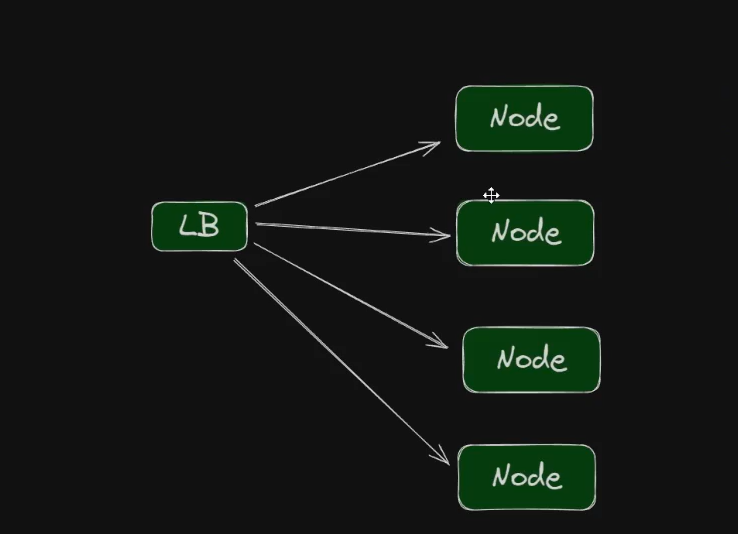

# Create Kubernets Cluster with K3d

## Creating
```powershell

kubectl version --client

k3d cluster create


```

Without Load Balancer


```powershell

k3d cluster create myCluster --no-lb

```

Creating with server:

```powershell

k3d cluster create myCluster --servers 3 --agents 3

k3d cluster create mycluster 


k3d cluster create myCluster --api-port 6443 --servers 3 --agents 3


k3d cluster create myCluster --servers 3 --agents 3 --port "6443:6443@loadbalancer"


k3d cluster create myCluster --servers 2 --agents 2 --port "8082:30080@agent:*"

k3d cluster create myCluster --servers 2 --agents 2 --port "8082:30080@agent:*" --api-port 127.0.0.1:6443

```

Mapping Ports:



```powershell

k3d cluster create myCluster --servers 3 --agents 3 -p "8080:30000@loadbalancer"


k3d kubeconfig get myCluster | Out-File -Encoding ascii $HOME\.kube\config


```


## Getting Info
It create a Node and a POD

- it is not for production

Get Nodes

```powershell

kubectl cluster-info
kubectl get nodes
```

Get a list of Clusters

```powershell

k3d cluster list

```

## Deleting

Deleting 

```powershell
k3d cluster delete


k3d cluster delete myCluster

```

## Deploying via yaml file 
```yaml
apiVersion: apps/v1
kind: Deployment
metadata:
  name: conversao
spec:
  selector:
    matchLabels:
      app: conversao
  template:
    metadata:
      labels:
        app: conversao
    spec:
      containers:
      - name: conversao
        image: kubedevio/conversao-temperatura:v1
        ports:
        - containerPort: 8080
          name: http
          protocol: TCP
---
apiVersion: v1
kind: Service
metadata:
  name: conversao
spec:
  selector:
    app: conversao
  type: NodePort
  ports:
  - port: 80
    targetPort: 8080
    name: http
    protocol: TCP
    nodePort: 30000
```
```powershell

kubectl apply -f deploy.yaml

kubectl get all

```


Ah, perfect — if you’re using **k3d**, then the problem is almost certainly that your k3d cluster isn’t running or `kubectl` isn’t pointed at it.
Here’s what to do step by step:

---

### 1. **Check if Your k3d Cluster Exists**

Run:

```sh
k3d cluster list
```

You should see a table with your cluster(s). Example output:

```
NAME       SERVERS   AGENTS   LOADBALANCER
mycluster  1         2        true
```

If no clusters are listed, you need to create one:

```sh
k3d cluster create mycluster
```

---

### 2. **Check if the Cluster is Running**

If it exists but is stopped:

```sh
k3d cluster start mycluster
```

---

### 3. **Verify `kubectl` Context**

Run:

```sh
kubectl config get-contexts
```

Make sure the current context is pointing to your k3d cluster (e.g. `k3d-mycluster` should have a `*` next to it).
If not, switch to it:

```sh
kubectl config use-context k3d-mycluster
```

---

### 4. **Test Connectivity**

```sh
kubectl cluster-info
```

You should see output like:

```
Kubernetes control plane is running at https://0.0.0.0:random-port
CoreDNS is running at https://...
```

If that works, you’re ready to apply your manifest:

```sh
kubectl apply -f deploy.yaml
```

---

### 5. **Use the Corrected YAML**

Make sure you use the **fixed manifest** I gave you earlier (your original YAML had indentation issues).

---


Great! Here’s a simple shell script that will:

✅ Check if a k3d cluster exists
✅ Create it if it doesn’t
✅ Start it if it’s stopped
✅ Switch your `kubectl` context
✅ Apply your fixed `deploy.yaml`

Save this as `deploy.sh` and run it with `bash deploy.sh`:

```bash
#!/bin/bash

CLUSTER_NAME="mycluster"
DEPLOY_FILE="deploy.yaml"

echo "🔎 Checking if k3d cluster '$CLUSTER_NAME' exists..."
if ! k3d cluster list | grep -q "$CLUSTER_NAME"; then
  echo "🚀 Cluster not found. Creating k3d cluster '$CLUSTER_NAME'..."
  k3d cluster create "$CLUSTER_NAME"
else
  echo "✅ Cluster '$CLUSTER_NAME' exists."
  echo "🔄 Ensuring cluster is running..."
  k3d cluster start "$CLUSTER_NAME"
fi

echo "🔧 Switching kubectl context to k3d-$CLUSTER_NAME..."
kubectl config use-context "k3d-$CLUSTER_NAME"

echo "📡 Verifying cluster connectivity..."
kubectl cluster-info || { echo "❌ Could not connect to cluster. Exiting."; exit 1; }

echo "📦 Applying Kubernetes manifests..."
kubectl apply -f "$DEPLOY_FILE"

echo "✅ Done! Your Deployment and Service should now be running."
echo "💡 Check with: kubectl get pods, kubectl get svc"
```

---

### How to Use:

1. Make sure your `deploy.yaml` contains the **fixed manifest** I gave you earlier.
2. Save the script as `deploy.sh` in the same directory as `deploy.yaml`.
3. Make it executable (Linux/Mac):

   ```sh
   chmod +x deploy.sh
   ```
4. Run it:

   ```sh
   ./deploy.sh
   ```

On Windows (PowerShell), you can run:

```powershell
bash deploy.sh
```

(if you have Git Bash installed, which usually comes with k3d setups).

---


# Troubleshooting


The error you're seeing, "connectex: A connection attempt failed because the connected party did not properly respond after a period of time," is a common issue on Windows when trying to connect to a k3d cluster. The core problem is that **kubectl is trying to connect to a private IP address (`192.168.1.37`) instead of the host machine.** This happens because `host.docker.internal` (the hostname k3d uses by default) often resolves to the IP address of the host machine on the internal Docker network, which isn't accessible from the Windows host itself.

To fix this, you need to manually change the cluster's address in your `kubeconfig` file.

### Step-by-Step Fix

1.  **Locate your `kubeconfig` file.** On Windows, it's typically located at `%USERPROFILE%\.kube\config`.

2.  **Open the file in a text editor.** Find the `clusters` section. It will look something like this:

    ```yaml
    apiVersion: v1
    clusters:
    - cluster:
        certificate-authority-data: <certificate-data>
        server: https://host.docker.internal:59495
      name: k3d-myCluster
    ```

3.  **Change the `server` address.** Replace `host.docker.internal` with `127.0.0.1` (or `localhost`).

    ```yaml
    apiVersion: v1
    clusters:
    - cluster:
        certificate-authority-data: <certificate-data>
        server: https://127.0.0.1:59495
      name: k3d-myCluster
    ```

4.  **Save the file and try again.** Now, when you run `kubectl get nodes`, it will attempt to connect to the correct IP address (`127.0.0.1`) on your local machine, which is where the k3d cluster's exposed port is listening.

Alternatively, you can delete the cluster and recreate it, specifying the port binding on **localhost** from the start:

`k3d cluster create myCluster --servers 2 --agents 2 --port "8082:30080@agent:*" --api-port localhost:6443`

This will ensure the `kubeconfig` is generated with `localhost` as the server address from the beginning.