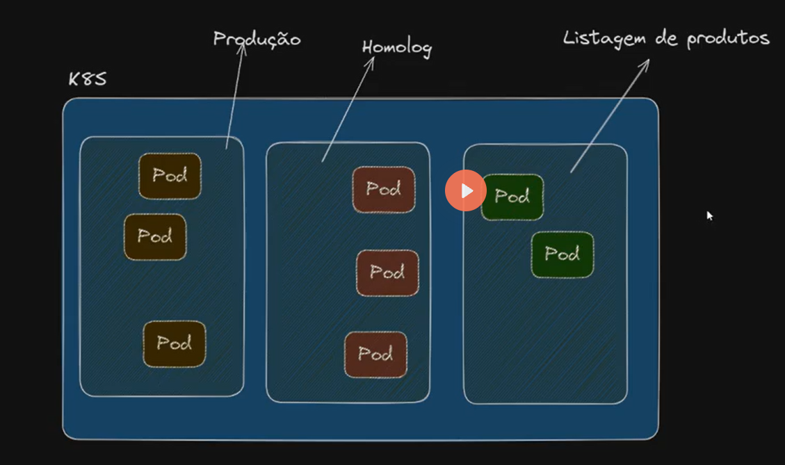

# Manage Environment

## Namespace

- Grouping Logically PODs, replicaSets, deployments

It is similiar to docker namespace, it creates a logical kubernetes clusters inside the pyshical kubernetes clusters isolating the resources logically.


it brings security, because you can have the namespaces
 - Dev : devs have access
 - UAT: testers, business have access
 - proudction: Only SMEs have access

 


 ## Getting the namespaces

 ```bash

kubectl get namespace

#output
NAME              STATUS   AGE
default           Active   7m53s 
kube-node-lease   Active   7m53s
kube-public       Active   7m53s
kube-system       Active   7m53s

 ```

**It is not a good practise to use or create ks8 inside the default.**

Specifying the namespace name:

```bash
kubectl get all -n kube-system

#output: 

NAME                                          READY   STATUS      RESTARTS   AGE
pod/coredns-ccb96694c-g7xsq                   1/1     Running     0          10m
pod/helm-install-traefik-crd-zhcsc            0/1     Completed   0          10m
pod/helm-install-traefik-fsdk9                0/1     Completed   1          10m
pod/local-path-provisioner-5cf85fd84d-nvm77   1/1     Running     0          10m
pod/metrics-server-5985cbc9d7-x727h           1/1     Running     0          10m
pod/svclb-traefik-f0a0e693-62tpw              2/2     Running     0          10m
pod/svclb-traefik-f0a0e693-7qjlz              2/2     Running     0          9m51s
pod/svclb-traefik-f0a0e693-9fdhn              2/2     Running     0          9m51s
pod/svclb-traefik-f0a0e693-b8cpt              2/2     Running     0          10m
pod/svclb-traefik-f0a0e693-h7kqq              2/2     Running     0          9m55s
pod/svclb-traefik-f0a0e693-tvqk5              2/2     Running     0          9m51s
pod/traefik-5d45fc8cc9-77ldt                  1/1     Running     0          10m

NAME                     TYPE           CLUSTER-IP      EXTERNAL-IP                                                         PORT(S)                      AGE
service/kube-dns         ClusterIP      10.43.0.10      <none>                                                              53/UDP,53/TCP,9153/TCP       10m
service/metrics-server   ClusterIP      10.43.206.146   <none>                                                              443/TCP                      10m
service/traefik          LoadBalancer   10.43.168.3     172.20.0.3,172.20.0.4,172.20.0.5,172.20.0.6,172.20.0.7,172.20.0.8   80:32146/TCP,443:30440/TCP   10m

NAME                                    DESIRED   CURRENT   READY   UP-TO-DATE   AVAILABLE   NODE SELECTOR   AGE
daemonset.apps/svclb-traefik-f0a0e693   6         6         6       6            6           <none>          10m

NAME                                     READY   UP-TO-DATE   AVAILABLE   AGE
deployment.apps/coredns                  1/1     1            1           10m
deployment.apps/local-path-provisioner   1/1     1            1           10m
deployment.apps/metrics-server           1/1     1            1           10m
deployment.apps/traefik                  1/1     1            1           10m

NAME                                                DESIRED   CURRENT   READY   AGE
replicaset.apps/coredns-ccb96694c                   1         1         1       10m
replicaset.apps/local-path-provisioner-5cf85fd84d   1         1         1       10m
replicaset.apps/metrics-server-5985cbc9d7           1         1         1       10m
replicaset.apps/traefik-5d45fc8cc9                  1         1         1       10m

NAME                                 STATUS     COMPLETIONS   DURATION   AGE
job.batch/helm-install-traefik       Complete   1/1           20s        10m
job.batch/helm-install-traefik-crd   Complete   1/1           17s        10m

```

## Creating a new Namespace

 there two ways to create a namespace on kubernetes:
  - 1 Imperative (command line)
  - 2 Declarative (yaml file)

### 1 - Imperative

```bash

kubectl create namespace production


kubectl get namespace
NAME              STATUS   AGE
default           Active   14m
kube-node-lease   Active   14m
kube-public       Active   14m
kube-system       Active   14m
production        Active   4s    #namespace created

```

### 2 - Declarative

```yaml

apiVersion: v1
kind: Namespace
metadata:
    name: homologacao

```


```bash
kubectl apply -f namespace.yaml


 kubectl get namespace
NAME              STATUS   AGE
default           Active   18m
homologacao       Active   7s # namespace created
kube-node-lease   Active   18m
kube-public       Active   18m
kube-system       Active   18m
production        Active   4m16s

```

## Created Pods, service in each namespace (Recommand)

Imperative way, recommended.

```bash

# to check it out all resources inside a namespace
kubectl get all -n production

# create a resources inside a namepace
kubectl apply -f deploy.yaml -n production


# getting the resources on production namespace
kubectl get all -n production

# output:

NAME                       READY   STATUS    RESTARTS   AGE
pod/web-5564d8c647-6n97t   1/1     Running   0          52s

NAME          TYPE        CLUSTER-IP   EXTERNAL-IP   PORT(S)   AGE
service/web   ClusterIP   10.43.7.43   <none>        80/TCP    52s

NAME                  READY   UP-TO-DATE   AVAILABLE   AGE
deployment.apps/web   1/1     1            1           52s

NAME                             DESIRED   CURRENT   READY   AGE
replicaset.apps/web-5564d8c647   1         1         1       52s

```


```bash

kubectl get po

# empty
No resources found in default namespace.


kubectl get po -n production

# output

NAME                   READY   STATUS    RESTARTS   AGE
web-5564d8c647-6n97t   1/1     Running   0          4m13s
```


## Mapping the port

```bash

kubectl port-forward service/web 8080:80

# output
Error from server (NotFound): services "web" not found


kubectl port-forward service/web 8080:80 -n production

# it works
Forwarding from 127.0.0.1:8080 -> 80
Forwarding from [::1]:8080 -> 80


http://localhost:8080
```


## Declarative (Not recommended)

```yaml

apiVersion: apps/v1
kind: Deployment
metadata:
  name: web
  namespace: homologacao
spec:
  selector:
    matchLabels:
      app: web
  template:
    metadata:
      labels:
        app: web
    spec:
      containers:
      - name: web
        image: kubedevio/web-color:green
        ports:
        - containerPort: 80
---
apiVersion: v1
kind: Service
metadata:
  name: web
  namespace: homologacao
spec:
  selector:
    app: web
  ports:
  - port: 80
    targetPort: 80

```

Command line

```bash

kubectl get namespace

kubectl apply -f deploy-ns.yaml -n homologacao

kubectl get all -n homologacao

NAME                       READY   STATUS    RESTARTS   AGE
pod/web-5564d8c647-bfplg   1/1     Running   0          19s

NAME          TYPE        CLUSTER-IP    EXTERNAL-IP   PORT(S)   AGE
service/web   ClusterIP   10.43.59.19   <none>        80/TCP    19s

NAME                  READY   UP-TO-DATE   AVAILABLE   AGE
deployment.apps/web   1/1     1            1           19s

NAME                             DESIRED   CURRENT   READY   AGE


kubectl port-forward service/web 8081:80 -n homologacao

# output

Forwarding from 127.0.0.1:8081 -> 80
Forwarding from [::1]:8081 -> 80

http://localhost:8081/

```

## Deleting a namespace

```bash

kubectl delete namespace homologacao


 kubectl get namespace
NAME              STATUS   AGE
default           Active   41m
kube-node-lease   Active   41m
kube-public       Active   41m
kube-system       Active   41m
production        Active   27m

# homologacao is gone
```


## Take aways

I have two k8s cluster running in one pyshical cluster.


# External Service

How a POD can access a service in another namespace?

**External Service**


External service yaml file 

it is very usuful for databae


## DNS

```bash

kubectl get pod -n production

```

Now let's create a pod in the default namespace and try to acces the service on
production namespace.

```bash

kubectl run curl -it --image ubuntu -- /bin/bash

# pod sh
root@curl:/# apt update && apt install curl --yes

# not found, because the web service is in another namespace "Production"
root@curl:/# curl http://web
curl: (6) Could not resolve host: web 

# where is the service?

# default
kubectl get svc

NAME         TYPE        CLUSTER-IP   EXTERNAL-IP   PORT(S)   AGE
kubernetes   ClusterIP   10.43.0.1    <none>        443/TCP   59m

# production
kubectl get svc -n production
NAME   TYPE        CLUSTER-IP   EXTERNAL-IP   PORT(S)   AGE
web    ClusterIP   10.43.7.43   <none>        80/TCP    36m # it is here!!!
```

## The k8s has a DNS

```bash

kubectl get svc -n  kube-system


NAME             TYPE           CLUSTER-IP      EXTERNAL-IP                                                         PORT(S)                      AGE
kube-dns         ClusterIP      10.43.0.10      <none>                                                              53/UDP,53/TCP,9153/TCP       61m #DNS here !!!!!!
metrics-server   ClusterIP      10.43.206.146   <none>                                                              443/TCP                      61m
traefik          LoadBalancer   10.43.168.3     172.20.0.3,172.20.  80:32146/TCP,443:30440/TCP   60m


kubectl get po -n  kube-system

NAME                                      READY   STATUS      RESTARTS   AGE
coredns-ccb96694c-g7xsq                   1/1     Running     0          62m #core dns
helm-install-traefik-crd-zhcsc            0/1     Completed   0          62m
helm-install-traefik-fsdk9                0/1     Completed   1          62m
local-path-provisioner-5cf85fd84d-nvm77   1/1     Running     0          62m
metrics-server-5985cbc9d7-x727h           1/1     Running     0          62m
svclb-traefik-f0a0e693-62tpw              2/2     Running     0          62m
svclb-traefik-f0a0e693-7qjlz              2/2     Running     0          62m
svclb-traefik-f0a0e693-9fdhn              2/2     Running     0          62m
svclb-traefik-f0a0e693-b8cpt              2/2     Running     0          62m
svclb-traefik-f0a0e693-h7kqq              2/2     Running     0          62m
svclb-traefik-f0a0e693-tvqk5              2/2     Running     0          62m
traefik-5d45fc8cc9-77ldt                  1/1     Running     0          62m

#get all pods and its namespaces
kubectl get pod -A


NAMESPACE     NAME                                      READY   STATUS      RESTARTS   AGE
default       curl                                      1/1     Running     0          8m8s # our tmp pod
kube-system   coredns-ccb96694c-g7xsq                   1/1     Running     0          63m # core dns
kube-system   helm-install-traefik-crd-zhcsc            0/1     Completed   0          64m
kube-system   helm-install-traefik-fsdk9                0/1     Completed   1          64m
kube-system   local-path-provisioner-5cf85fd84d-nvm77   1/1     Running     0          63m
kube-system   metrics-server-5985cbc9d7-x727h           1/1     Running     0          63m
kube-system   svclb-traefik-f0a0e693-62tpw              2/2     Running     0          63m
kube-system   svclb-traefik-f0a0e693-7qjlz              2/2     Running     0          63m
kube-system   svclb-traefik-f0a0e693-9fdhn              2/2     Running     0          63m
kube-system   svclb-traefik-f0a0e693-b8cpt              2/2     Running     0          63m
kube-system   svclb-traefik-f0a0e693-h7kqq              2/2     Running     0          63m
kube-system   svclb-traefik-f0a0e693-tvqk5              2/2     Running     0          63m
kube-system   traefik-5d45fc8cc9-77ldt                  1/1     Running     0          63m
production    web-5564d8c647-6n97t                      1/1     Running     0          41m # our web service
```

## Accessing the service in a different namespace

```bash
#curt tmp pod

#ex.: curl http://[service-name].[namespace].svc.cluster.local

curl http://web.production.svc.cluster.local


root@curl:/# curl http://web.production.svc.cluster.local

#output
<body style="text-align: center;background-color: blue;">
   <H1>PÁGINA DE TESTE</H1>

    <h3> Servidor que processou a requisição - web-5564d8c647-6n97t </h3> 

```

When you provide the fullname of the service the k8s understands what it needs to looking for via the internal DNS pod.

running many times, we can see that the name of the pods have changed:

```bash
root@curl:/# curl http://web.production.svc.cluster.local
<body style="text-align: center;background-color: blue;">
   <H1>PÁGINA DE TESTE</H1>

    <h3> Servidor que processou a requisição - web-5564d8c647-6n97t </h3>
root@curl:/# curl http://web.production.svc.cluster.local
<body style="text-align: center;background-color: blue;">
   <H1>PÁGINA DE TESTE</H1>

    <h3> Servidor que processou a requisição - web-5564d8c647-d7w7g </h3> 
</body>root@curl:/# curl http://web.production.svc.cluster.local
<body style="text-align: center;background-color: blue;">
   <H1>PÁGINA DE TESTE</H1>

    <h3> Servidor que processou a requisição - web-5564d8c647-d7w7g </h3> 
</body>root@curl:/# curl http://web.production.svc.cluster.local
<body style="text-align: center;background-color: blue;">
   <H1>PÁGINA DE TESTE</H1>

    <h3> Servidor que processou a requisição - web-5564d8c647-cqgnv </h3>
</body>root@curl:/# curl http://web.production.svc.cluster.local
<body style="text-align: center;background-color: blue;">
   <H1>PÁGINA DE TESTE</H1>

    <h3> Servidor que processou a requisição - web-5564d8c647-6n97t </h3>

```


```yaml

apiVersion: v1
kind: Service
metadata:
  name: web
spec:
  type: ExternalName
  externalName: web.production.svc.cluster.local

```

```bash

kubectl apply -f external-service.yaml

kubectl get svc

NAME         TYPE           CLUSTER-IP   EXTERNAL-IP                      PORT(S)   AGE
kubernetes   ClusterIP      10.43.0.1    <none>                           443/TCP   74m
web          ExternalName   <none>       web.producao.svc.cluster.local   <none>    9s # This service is pointing to the wrb service on produciton namespace (External-IP)


```

Now we can go into the tmp pod and access the external service

```bash

root@curl:/# curl http://web
<body style="text-align: center;background-color: blue;">
   <H1>PÁGINA DE TESTE</H1>

    <h3> Servidor que processou a requisição - web-5564d8c647-cqgnv </h3> 
</body>root@curl:/# curl http://web
<body style="text-align: center;background-color: blue;">
   <H1>PÁGINA DE TESTE</H1>

    <h3> Servidor que processou a requisição - web-5564d8c647-88fbs </h3> 
</body>root@curl:/# 


```


what we did?


# NAMESPACED resource

the are some Resouces which are not namespaced.

```bash

kubectl api-resources


NAME                                SHORTNAMES   APIVERSION                        NAMESPACED   KIND
bindings                                         v1                                true         Binding
componentstatuses                   cs           v1                                false        ComponentStatus
configmaps                          cm           v1                                true         ConfigMap
endpoints                           ep           v1                                true         Endpoints
events                              ev           v1                                true         Event
limitranges                         limits       v1                                true         LimitRange
namespaces                          ns           v1                                false        Namespace
nodes                               no           v1                                false        Node
persistentvolumeclaims              pvc          v1                                true         PersistentVolumeClaim
persistentvolumes                   pv           v1                                false        PersistentVolume
pods                                po           v1                                true         Pod
podtemplates                                     v1                                true         PodTemplate
replicationcontrollers              rc           v1                                true         ReplicationController
resourcequotas                      quota        v1                                true         ResourceQuota
secrets                                          v1                                true         Secret
serviceaccounts                     sa           v1                                true         ServiceAccount]


```

To see all the resouces and namespaces together

```bash

kubectl get po --all-namespaces

#or
kubectl get po -A

#output 
NAMESPACE     NAME                                      READY   STATUS      RESTARTS   AGE
default       curl                                      1/1     Running     0          29m
kube-system   coredns-ccb96694c-g7xsq                   1/1     Running     0          85m
kube-system   helm-install-traefik-crd-zhcsc            0/1     Completed   0          85m
kube-system   helm-install-traefik-fsdk9                0/1     Completed   1          85m
kube-system   local-path-provisioner-5cf85fd84d-nvm77   1/1     Running     0          85m
kube-system   metrics-server-5985cbc9d7-x727h           1/1     Running     0          85m
kube-system   svclb-traefik-f0a0e693-62tpw              2/2     Running     0          84m
kube-system   svclb-traefik-f0a0e693-7qjlz              2/2     Running     0          84m
kube-system   svclb-traefik-f0a0e693-9fdhn              2/2     Running     0          84m
kube-system   svclb-traefik-f0a0e693-b8cpt              2/2     Running     0          84m
kube-system   svclb-traefik-f0a0e693-h7kqq              2/2     Running     0          84m
kube-system   svclb-traefik-f0a0e693-tvqk5              2/2     Running     0          84m
kube-system   traefik-5d45fc8cc9-77ldt                  1/1     Running     0          84m
production    web-5564d8c647-6n97t                      1/1     Running     0          62m
production    web-5564d8c647-88fbs                      1/1     Running     0          14m
production    web-5564d8c647-cqgnv                      1/1     Running     0          14m
production    web-5564d8c647-d7w7g                      1/1     Running     0          14m
production    web-5564d8c647-dpxcf                      1/1     Running     0          14m

```

