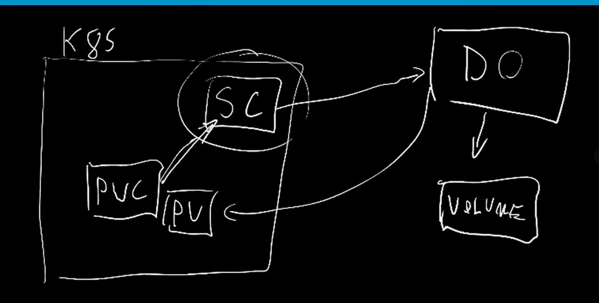
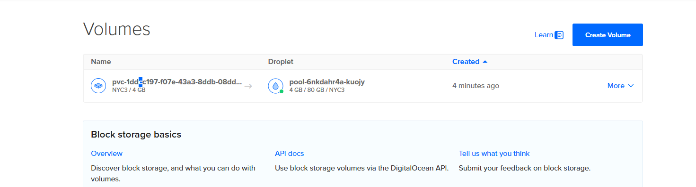
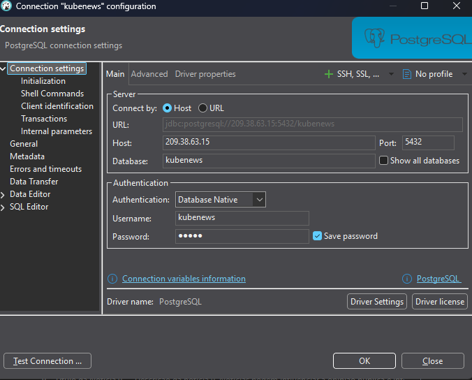

# Storage Class

The daynamic way

## Workflow




## Digital Ocean

 - 1 Create a cluster kubernete on Digital Oncen
 - 2 Dowloand the kubeconfig

 
```sh

kubectl pv

kubectl pvc

kubectl get storageclass


# result digital ocean

kubectl get storageclass
NAME                          PROVISIONER                 RECLAIMPOLICY   VOLUMEBINDINGMODE   ALLOWVOLUMEEXPANSION   AGE
do-block-storage (default)    dobs.csi.digitalocean.com   Delete          Immediate           true                   9m7s
do-block-storage-retain       dobs.csi.digitalocean.com   Retain          Immediate           true                   9m7s
do-block-storage-xfs          dobs.csi.digitalocean.com   Delete          Immediate           true                   9m7s
do-block-storage-xfs-retain   dobs.csi.digitalocean.com   Retain          Immediate           true                   9m6s


```


***WE DON'T NEED A PV.YAML FILE BECAUSE IT WILL CREATED AUTMOTICALLY***


### Deploying

```sh

kubectl apply -f deployment.yaml

# pv created dynamically
kubectl get pv
NAME                                       CAPACITY   ACCESS MODES   RECLAIM POLICY   STATUS   CLAIM            STORAGECLASS       VOLUMEATTRIBUTESCLASS   REASON   AGE
pvc-1ddcc197-f07e-43a3-8ddb-08dd768fcf32   4Gi        RWO            Delete           Bound    default/db-pvc   do-block-storage   <unset>                          16s


kubectl get pvc
NAME     STATUS   VOLUME                                     CAPACITY   ACCESS MODES   STORAGECLASS       VOLUMEATTRIBUTESCLASS   AGE
db-pvc   Bound    pvc-1ddcc197-f07e-43a3-8ddb-08dd768fcf32   4Gi        RWO            do-block-storage   <unset>                 103s


# service

kubectl get svc

kubectl get svc
NAME         TYPE           CLUSTER-IP      EXTERNAL-IP    PORT(S)          AGE
kubernetes   ClusterIP      10.108.32.1     <none>         443/TCP          16m
postgre      LoadBalancer   10.108.60.244   209.38.63.15   5432:30167/TCP   2m15s

# we will this ip 209.38.63.15 to connect to dveaver


```

My PV created automacally on the Digial Ocean:




## DBeaver

```

Connect DBeaver:

| Field                    | What to put                                                   |
| ------------------------ | ------------------------------------------------------------- |
| **Host name/address**    | 209.38.63.15                                                     |
| **Port**                 | `5432` *(or whatever host port you mapped in Docker Compose)* |
| **Maintenance database** | `kubenews` *(or the database you defined in Docker Compose)*  |
| **Username**             | `kubenews` *(from your environment variables)*                |
| **Password**             | `pq123` *(from your environment variables)*                   |
| **Save password?**       | ON (so you don’t have to type it every time)                  |


```

