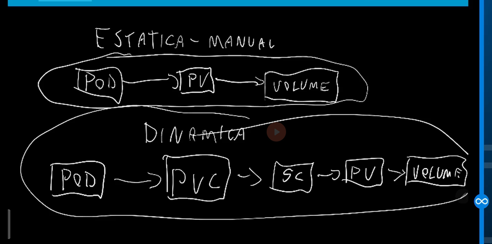

# Persistence Volume

- Target: 
Simply the volume use in Kubernetes

## Stateless Application

 - Web Application

## Statefull Application
 - Postsgree
 - Database (File system)

 Everytime you have to work with a Statefull application you should consider the file system. 

 The container didn't save the file system. 

 You should map the file system to an external volume.

 ## 3 Key Concepts

  - 1. Volume: Where you're going to save the data
  - 2. PS (Persistente Volume): A representaton of the volume on Kubernetes.
  - 3. Persistence Volume Claim.


### Pense assim: um **HD para guardar dados**

1️⃣ **Volume**
É o **lugar físico onde os dados ficam guardados**.
Pode ser um HD, SSD, NFS, disco na nuvem (AWS, GCP, Azure etc).
👉 É onde o dado realmente mora.

2️⃣ **Persistent Volume (PV)**
É o **cadastro desse volume dentro do Kubernetes**.
O Kubernetes não usa o disco direto; ele cria um “registro” dizendo:

> “Existe um espaço de armazenamento com X tamanho e tipo”.

👉 O PV **representa o volume real** para o Kubernetes.

3️⃣ **Persistent Volume Claim (PVC)**
É o **pedido de uso desse volume** feito pela aplicação (pod).
A aplicação diz algo como:

> “Preciso de 10GB de armazenamento”.

👉 O Kubernetes procura um **PV compatível** e conecta ele ao pod.

---

### Resumão em uma frase

* **Volume** = onde o dado é salvo de verdade
* **PV** = descrição desse volume no Kubernetes
* **PVC** = pedido para usar esse volume


# Exemplo


### 🏢 Analogia: Apartamento

1️⃣ **Volume (o apartamento de verdade)**
É o **apartamento físico**: existe, tem quartos, espaço, endereço.
👉 É onde você realmente mora (onde os dados ficam).

---

2️⃣ **Persistent Volume (PV) – o anúncio do apartamento**
É o **anúncio no site** dizendo:

> “Apartamento disponível, 50m², 2 quartos, mobiliado”.

👉 O Kubernetes usa o PV para **saber que esse espaço existe**.

---

3️⃣ **Persistent Volume Claim (PVC) – o pedido de aluguel**
É quando alguém diz:

> “Quero alugar um apartamento com pelo menos 40m²”.

👉 O Kubernetes vê os anúncios (PVs) e **liga o pedido (PVC) ao apartamento (PV)**.

---

### 🔗 Quando tudo se conecta

* O **PVC escolhe um PV**
* O **Pod usa o PVC**
* Os **dados ficam salvos no Volume**, mesmo se o pod morrer

---

### 📌 Frase final para memorizar

> **Pod não usa volume direto → usa PVC → que aponta para um PV → que representa o volume real**


## Workflow
```
┌──────────────┐
│     POD      │
│ (aplicação)  │
└──────┬───────┘
       │
       │ usa
       ▼
┌─────────────────────────┐
│   PVC (Pedido)          │
│ "Preciso de 10GB"       │
└─────────┬───────────────┘
          │
          │ conecta
          ▼
┌─────────────────────────┐
│   PV (Registro)         │
│ "Volume de 10GB"        │
└─────────┬───────────────┘
          │
          │ representa
          ▼
┌─────────────────────────┐
│   VOLUME REAL            │
│ (Disco / Nuvem / HD)     │
│ Onde os dados ficam      │
└─────────────────────────┘
```

### 🔑 Ideia principal

* **Pod** → não conhece disco
* **PVC** → pede espaço
* **PV** → oferece espaço
* **Volume real** → guarda os dados

