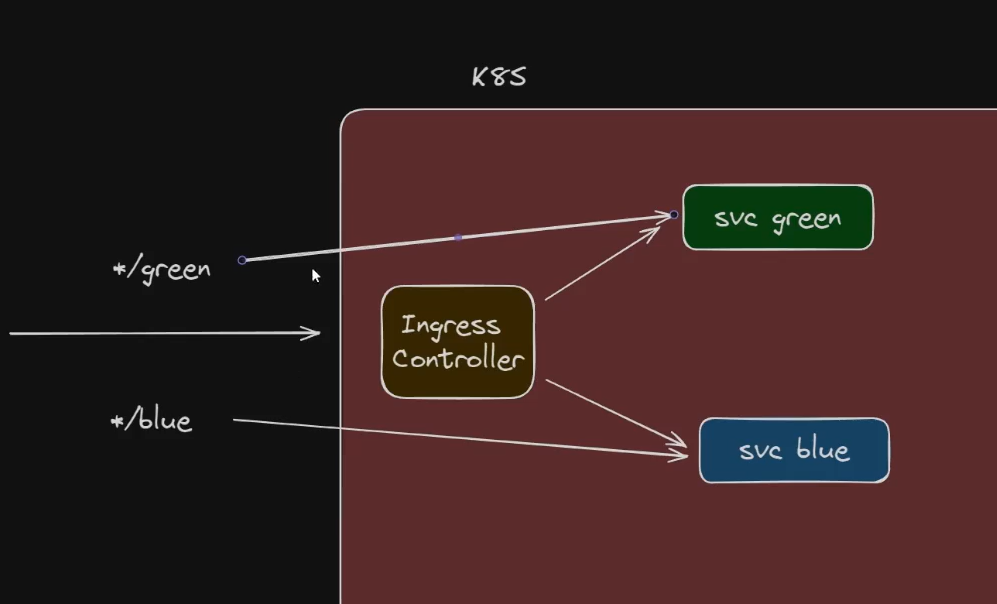

# Igress Rueles


## 1. Creating a Kubernetes Kluster for a Postgress service

Using Kind


```bash


# I set the image inside the yaml file
kind create cluster --name mycluster --config kind-config.yaml

# List Clusters
kind get clusters

kind delete cluster

kind delete cluster --name mycluster

```

## 2 Apply the rules


```bash

kubectl apply -f ingress.yaml

kubectl get igress

```

### Work Flow Traffic

It goes to the green service only


## 3 Bind the igress rule to Igress Control

Get the available ingresses

```bash

kubectl get ingressclass

```
Added it into yaml file

```yaml


   igressClassName: nginx

```

Now you can deploy the changes:

```bash

kubectl apply -f ingress.yaml

kubectl get ingressclass

```


# Rule based on Path

Setting different routes




```bash

kubectl apply -f ingress.yaml

kubectl get ingressclass

```

 Access blue and green endpoints


 ```
55.49.469.74/blue 

55.49.469.74/green

 ```

 # Path Types


 **Prefix**

 [Link to the Ingress Path](https://kubernetes.io/docs/concepts/services-networking/ingress/#examples)

```bash

   #works,  get everything after the prefix
    55.49.469.74/green/xpto

 ```
 

  **Exact**
```bash

   #Fails 404 not Found, it expects the exactly type /green
    55.49.469.74/green/xpto

 ```


# Default backend


