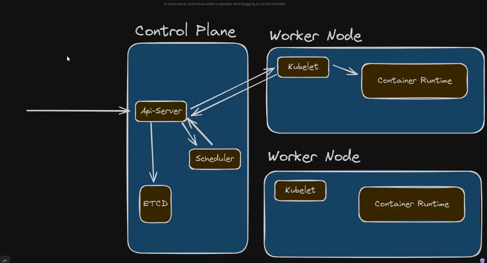

# Pod Life Cycle

[Link Documentation](https://kubernetes.io/docs/concepts/workloads/pods/pod-lifecycle/)


### Work Flow




### 1. Create a cluster

```bash

k3d cluster create mycluster --servers 3 --agents 3 --port "8082:30080@loadbalancer:*" --api-port localhost:6443

kubectl get nodes

```
### 2. Create yaml file

ngxinx.yaml file:

```yaml

apiVersion: apps/v1
kind: Deployment
metadata:
  name: nginx
spec:
  selector:
    matchLabels:
      app: nginx
  template:
    metadata:
      labels:
        app: nginx
    spec:
      containers:
        - name: nginx
          image: nginx
          ports:
            - containerPort: 80

```


### 3. Deploy

Now we going to delopy it

```bash

kubectl apply -f nginx.yaml

kubectl get pod -o wide

kubectl get po

kubectl describe pod jrksdjrkjk


```

## POD Status

It tells the current status of the pod.

**running**: all the containers are running inside the pod
**restarted**: How many times the pod was restarted
**peding**: There is no worker node to run the pod or downloading the image.
**completed**: Job when the pod runs a service and is terminated.
**failed**: when something goes work well.


## Container Status

It tells the current status of the pod.

```bash

kubectl get po

kubectl describe pod jrksdjrkjk

```

**running**: the container is running
**failed**: when something goes work well.
**waiting**:waiting the image to be dowloaded
**terminated**: TJob when the pod runs a service and is terminated.


## Signal SIGTERM & Signal SIGKILL

**SIGTERM**: it is when the OS sends a message to the control panel that the pod will be terminated.
you have a few seconds to terminate the application.

**SIGKILL**: Abrupted. the pod is terminated at the time.

Here is a **very simple and brief** explanation:

---

## SIGTERM (Soft Stop)

* Means: **“Please stop now”**
* Kubernetes sends this **first**
* Gives the app time to:

  * Finish work
  * Close connections
  * Save data

👉 The app **can handle it**

---

## SIGKILL (Hard Stop)

* Means: **“Stop NOW”**
* Sent **after SIGTERM** if the app doesn’t stop
* App is killed **immediately**
* App **cannot react**

---

## In Kubernetes (Simple Flow)

```
Pod needs to stop
      |
   SIGTERM
      |  (grace period)
      v
App stops nicely?
   |        |
  Yes      No
   |        |
 Pod ends  SIGKILL
```

---

## Easy Memory Tip

* **SIGTERM = polite**
* **SIGKILL = force**

## terminationGracePeriodSeconds

## terminationGracePeriodSeconds (Very Simple)

**terminationGracePeriodSeconds** tells Kubernetes **how long to wait before killing a Pod**.

---

### What Happens (Simple)

1. Pod needs to stop
2. Kubernetes sends **SIGTERM**
3. Kubernetes **waits** for the time you set
4. If the app is still running → **SIGKILL**

---

### Example (30 seconds)

```yaml
terminationGracePeriodSeconds: 30
```

```
SIGTERM sent
     |
<--- 30 seconds --->
     |
SIGKILL (if still running)
```

---

### Why It’s Important

* Lets the app:

  * Finish requests
  * Save data
  * Close connections

---

### Default Value

* **30 seconds**

---

### Easy Rule

> Give your app enough time to stop cleanly, but not forever.

```yaml

apiVersion: apps/v1
kind: Deployment
metadata:
  name: web-app
spec:
  template:
    spec:
      terminationGracePeriodSeconds: 30 #here it is where define the timeout or the deploy before to kill the pod.
      containers:
        - name: web
          image: my-web-app

```


## Post Start and Pre Stop

Here is a **very short and simple** explanation with a **text diagram** 👇

---

## postStart (After Start)

* Runs **after** the container starts
* Used for **setup**
* Example: create files, warm cache

---

## preStop (Before Stop)

* Runs **before** the container stops
* Used for **clean shutdown**
* Example: stop accepting traffic, close connections

---

## Simple Diagram

```
Container Start
      |
   postStart
      |
  App Running
      |
   preStop
      |
   SIGTERM
      |
(wait grace time)
      |
 Container Stops
```

---

## Easy Memory Tip 🧠

* **postStart = after start**
* **preStop = before stop**

[Webhook web site](https://webhook.site/)

**Deployment.yaml** file:

```yaml

apiVersion: apps/v1
kind: Deployment
metadata:
  name: nginx
spec:
  selector:
    matchLabels:
      app: nginx
  template:
    metadata:
      labels:
        app: nginx
    spec:
      containers:
      - name: nginxx
        image: nginx
        ports:
        - containerPort: 80
        lifecycle:
            postStart:
                exec:
                command: ["/bin/sh", "-c", "curl -X POST https://webhook.site/4224e44a-c967-4e0d-8b12-e3f5355592be -d 'Post start exect'"]
            preStop:
                exec:
                command: ["/bin/sh", "-c", "curl -X POST https://webhook.site/4224e44a-c967-4e0d-8b12-e3f5355592be -d 'Pre Stop exect'"]
---
apiVersion: v1
kind: Service
metadata:
  name: nginx
spec:
  selector:
    app: nginx
  ports:
  - port: 80
    targetPort: 80
    nodePort: 30000
  type: LoadBalancer

```

Running the deploy command:

```bash

kubectl apply - deployment.yaml

# a http post will be submitted to my webhook vith post start

kubectl get po

kubectl delete po 5445gafd
# a http post will be submitted to my webhook with before stop


# change the url of the webhook. it will cause an issue. 
# how to troubleshooting it?

kubectl get pod nginx rjkdjkj -o yaml

# go to state and look for the attribute message.
```


# Init Container 

An **Init Container** is a specialized container that runs **before** the main app containers in a Pod. It must complete successfully before the next one starts.

### Key Characteristics

* **Run to Completion:** They don't stay running; they perform a task and exit.
* **Sequential Execution:** If you have multiple init containers, they run one by one in the order defined.
* **Isolation:** They can contain setup scripts or utilities (like `git` or `sed`) that you don't want to include in your main, secure app image.
* **Blocking:** The main app container will never start if an init container fails.

---

### Execution Flow Diagram

```text
Pod Startup
│
├──> [ Init Container 1 ]  (e.g., Wait for DB to be ready)
│           │
│        Success
│           │
├──> [ Init Container 2 ]  (e.g., Pull configuration files)
│           │
│        Success
│           │
└──> [ Main App Container ] (e.g., Python/Java API)
            │
         Running

```

---

### Common Use Cases

* **Delaying Start:** Waiting for a service (like a Database) to be reachable.
* **Preparation:** Registering the Pod with a remote server or generating dynamic config files.
* **Security:** Performing sensitive setup tasks that require permissions the main app shouldn't have.

## Example


initial.yaml

```yaml

apiVersion: apps/v1
kind: Deployment
metadata:
  name: web-color
spec:
  selector:
    matchLabels:
      app: web-color
  template:
    metadata:
      labels:
        app: web-color
    spec:
      containers:
      - name: web-color
        image: fabricioveronez/web-color:blue
        ports:
        - containerPort: 80
---
apiVersion: v1
kind: Service
metadata:
  name: web-color
spec:
  selector:
    app: web-color
  ports:
  - port: 80
    targetPort: 80
  type: LoadBalancer

```


deployment.yaml

```yaml

apiVersion: apps/v1
kind: Deployment
metadata:
  name: nginx
spec:
  selector:
    matchLabels:
      app: nginx
  template:
    metadata:
      labels:
        app: nginx
    spec:
      initContainers: # ininit container is another container inside your pod.
      - name: start
        image: fabricioveronez/ubuntu-curl:v1
        command: ["sh","-c","curl http://web-color -o /app/index.html"]
        volumeMounts:
           - mountPath: /app
             name: nginx-vol
      containers:
      - name: nginx
        image: nginx
        ports:
        - containerPort: 80
        volumeMounts:
            - mountPath: /usr/share/nginx/html
              name: nginx-vol
      volumes:
        - name: nginx-vol
          emptyDir:
            sizeLimit: 30Mi
---
apiVersion: v1
kind: Service
metadata:
  name: nginx
spec:
  selector:
    app: nginx
  ports:
  - port: 80
    targetPort: 80
    nodePort: 30000
  type: LoadBalancer

```


commands

```bash

kubectl apply -f deployment.yaml

kubectl port-forward svc/nginx 8080:80

```