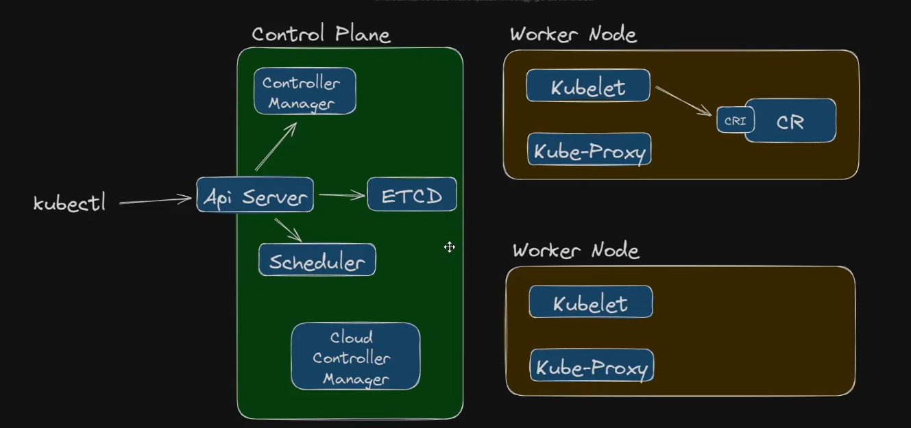
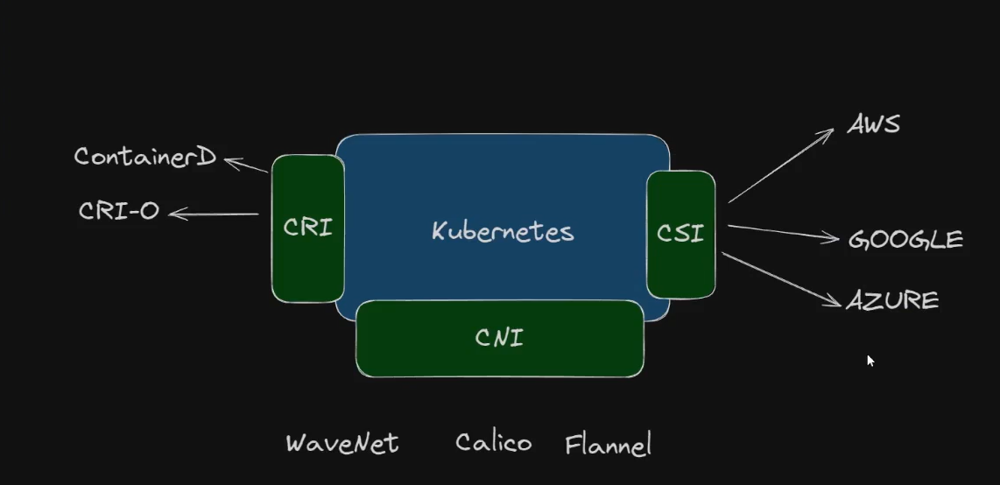

# Kubnertes

### Docker Swarm
don't waste time, nobody uses it.

### Apache Mesos
Nobody uses it either. Don't waste time.

### HashCorp
It is good, but nobody uses it.

## Introduction

Kuberntes was created by Google.
There is a SRE book from Good, where you can learn more about it.

***Kubernetes*** comes from a greek work which means "Pilot", because
it manages other 7 services.

Kubernetes is a manager, that you can to orchestract your conteiners.

### Important Links

[CNCF Landscape](https://landscape.cncf.io/)

[Certified Kubernetes Software Conformance](https://www.cncf.io/training/certification/software-conformance)

[Certified Kubernetes Application Developer (CKAD)](https://www.cncf.io/training/certification/ckad)

[Certified Kubernetes Administrator (CKA)](https://www.cncf.io/training/certification/cka)

[Certified Kubernetes Security Specialist (CKS)](https://www.cncf.io/training/certification/cks)

[Kubecon](https://www.cncf.io/kubecon-cloudnativecon-events)

[KCD Brasil](https://community.cncf.io/kcd-brasil)

 
 ## Kubernetes Infrastructure

 #### Control Plane: 
 Manager: ***Maestro***

 #### Worker Node:
 Run the PODs, ***musicians***

 

 - CRI : Container Runtime Interface
 - CNI : Container Network Interface
 - CSI : Container Storage Interface (Volumes)

  

## Cluster Kubernetes

### On Premise
You're responsible, don't do it if you are not a specialists or if you have a small team. You won't live, because it takes time.

### Cloud (As Service)
 - AWS
 - Azure
 - Google Cloud

 ### Local
  - Minikube
  - K3D (K3s ligtht, good for IOT)
  - Kind (admin)

