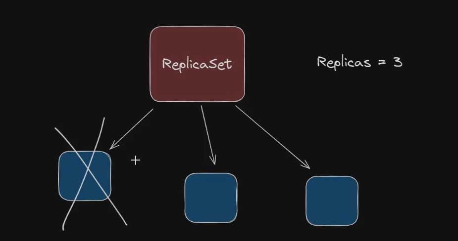

# ReplicaSet

A **ReplicaSet** in Kubernetes is a controller that ensures a specified number of identical pods, called **replicas**, are running at all times. Its main purpose is to maintain the desired number of pods to guarantee the availability and reliability of an application. 

### How it Works

A ReplicaSet acts as a supervisor for your pods. It's defined by a YAML file that specifies:

1.  **The desired number of replicas:** This is the count of pods you want to keep running.
2.  **A pod template:** This acts as a blueprint for the pods, defining their configuration (e.g., container image, ports, labels).
3.  **A selector:** This specifies how the ReplicaSet identifies which pods it should manage, typically by matching labels.

Once deployed, the ReplicaSet constantly monitors the cluster. If the number of running pods drops below the desired count (e.g., if a pod crashes, a node fails, or a pod is manually deleted), the ReplicaSet immediately creates new pods to replace them. This "self-healing" behavior ensures your application is highly available. 


***

### ReplicaSet vs. Deployment

While you can use a ReplicaSet directly, it's rarely done in practice. In most cases, you use a **Deployment**, which is a higher-level tool that manages ReplicaSets for you.

* **ReplicaSet:** Focuses on maintaining a stable count of pods. It does **not** handle rolling updates, rollbacks, or other advanced deployment strategies.
* **Deployment:** Manages the entire lifecycle of your application. When you update a Deployment's configuration (e.g., change the container image), it automatically creates a new ReplicaSet, gradually scales down the old one, and scales up the new one, ensuring a smooth, zero-downtime update. This makes Deployments the standard way to deploy applications in Kubernetes.



# Labels and Selectors


Think of **labels** and **selectors** as a system for organizing and finding things in your Kubernetes cluster. It's like putting sticky notes on objects and then using a search filter to find all the objects with a specific note. 🏷️


```powershell

kubectl delete -f replicaset.yaml

kubectl get replicaset

kubectl describe replicaset

```
### linux

```powershell
kubeclt apply -f replicaset.yaml && watch 'kubectl get rs, po'
```


### windows 11

```powershell

kubectl apply -f replicaset.yaml; while ($true) {Clear-Host; kubectl get rs,po; Start-Sleep -Seconds 2}
                  
```

### Testing the resilience


```powershell

kubectl delete pod/myreplicaset-2jr9b
kubectl delete pod/myreplicaset-t7cpm 
kubectl delete pod/myreplicaset-2jr9b  
kubectl delete pod/myreplicaset-ckr2t


kubectl get pods -o wide

# abbreviation of `kubectl get replicaset`
kubectl get rs

kubectl describe rs

kubeclt describe pod myreplicaset-gwmj4

```
# IMPORTANT
If you only update the docker image on the yaml file and apply the changes to your replicaset , it won't update the container running in pod. 
When you delete a pod, the replicaset will crete a
new onde updated. but it is not a good right? deleting your pods, it would be better if we have a automatic way for it. 

Good news, we have: 

Replicaset gives to you scalability and resilience but not updating. 

**For that, you have to the deployment.**