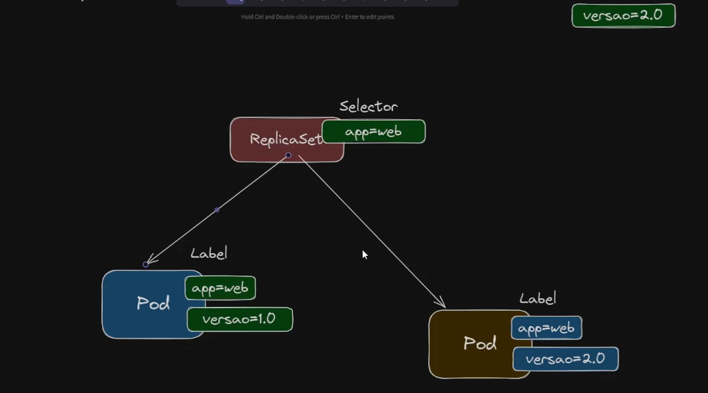

# PODs

The smallst unit in Kuberntes

- You can have more than one container in a POD

K8s replic PODs!!


FluentD Logs: it is  a good reason to run more than onde container inside the same POD.

Nacked POD

### Creating a POD inside a Cluster Kubernetes

List all objects that youb canbn create:

```powershell

kubectl api-resources

```

Create the declarative way (via file):

Structure: 
```yaml
apiVersion:
kind:
metadata:
spec:

```
Sure! Here’s a brief explanation of each property in a typical Kubernetes YAML file:

* **`apiVersion:`**
  Specifies which version of the Kubernetes API you are using for this resource.
  Example: `apps/v1`, `v1`

* **`kind:`**
  Defines what type of Kubernetes object you are creating.
  Example: `Pod`, `Deployment`, `Service`

* **`metadata:`**
  Contains data that uniquely identifies the object, like `name`, `namespace`, `labels`, and `annotations`.

* **`spec:`**
  Describes the desired state of the object — its configuration details.
  Example: container images for a Pod, number of replicas for a Deployment, ports for a Service.

Would you like me to show you a **small example YAML** with these fields filled in so you can see how they work together?


Pod Yaml

```yaml

apiVersion: v1
kind: Pod
metadata:
  name: mypod #only lowercs
spec:
  containers:
    - name: web
      image: kubedevio/web-color:blue
      ports:
        - name: http
          containerPort: 80
          protocol: TCP
```

```powershell


kubectl apply -f pod.yaml

kubectl get pods

#or

kubectl get all

kubectl describe pod mypod

kubectl get pods -o wide

```
## Mapping Ports from Host to Pod:

```powershell

kubectl port-forward pod/mypod 8080:80


```

## Nacked pod

A "naked pod" is a **Kubernetes Pod** that is created directly, without being managed by a higher-level controller like a **Deployment** or **ReplicaSet**. 

Think of it this way: 

* A **Pod** is the smallest unit you can create in Kubernetes. It's like a single pea in a pod, containing your container(s). 🟢
* A **Deployment** is a "manager" that wraps around your Pod. It ensures that a certain number of Pods are always running, and if a Pod fails or a server goes down, the Deployment automatically creates a new one to replace it. It's like having a team leader who makes sure the job is always done. 🧑‍💼

A naked pod is essentially a Pod that has **no manager**. If that pod crashes, is deleted, or the node it's running on fails, Kubernetes will **not automatically recreate it**. This makes naked pods unsuitable for most production applications that need to be resilient and highly available.

---

### When to Use a Naked Pod

While you should generally use a Deployment, naked pods can be useful for:

* **Debugging or testing:** You might create a temporary pod to test a configuration or run a one-off command.
* **One-off tasks:** A pod for a job that runs once and then terminates, such as a data migration script.

***YOU MUST HAVE A CONTROLLER ABOVE THE POD, SO THE KS8 WILL BE ABLE TO RECRETE TI***

The controller name is **ReplcaSet**

## Deleting Pod

Deleting one pod:

```powershell

kubectl delete pod mypod

```

Deleting many pods:


```powershell

kubectl delete -f pod.yaml

```

## Labels: The Sticky Notes

**Labels** are key-value pairs that you attach to any Kubernetes object, such as a Pod, Service, or Deployment. They are meant to be meaningful to you and your team.

  * **Key:** The category or type of information (e.g., `app`, `tier`, `environment`).
  * **Value:** The specific value for that category (e.g., `frontend`, `database`, `production`).

You can add multiple labels to a single object. Here's an example of how you might add labels to a Pod in a YAML file:

```yaml
apiVersion: v1
kind: Pod
metadata:
  name: my-web-server
  labels:
    app: web-server
    tier: frontend
    environment: production
```

These labels help you organize your resources. For instance, you could label all your frontend pods with `tier: frontend` and all your backend pods with `tier: backend`.

-----

## Selectors: The Search Filter

A **selector** is a query that uses labels to find a specific group of objects. It's the mechanism that brings labels to life. 🔍

For example, a **Service** doesn't manage pods directly; instead, it uses a selector to find all the pods that it should send traffic to.

Here's a Service manifest that uses a selector to find all pods with the label `app: web-server`:

```yaml
apiVersion: v1
kind: Service
metadata:
  name: web-service
spec:
  selector:
    app: web-server
  ports:
    - protocol: TCP
      port: 80
      targetPort: 8080
```

With this configuration, the Service will automatically find and route traffic to any and all pods that have the `app: web-server` label, regardless of how many there are or where they are running.

This makes Kubernetes extremely powerful because it allows you to dynamically manage groups of resources without needing to hardcode specific names.

You can also use selectors with `kubectl` commands to perform actions on a group of objects. For example, to get a list of all pods with the label `environment=production`, you would run:

`kubectl get pods -l environment=production`

This video provides a practical explanation of how to use labels and selectors to organize and manage your Kubernetes resources.
`https://www.youtube.com/watch?v=ndzhtFtJT9A`
http://googleusercontent.com/youtube_content/0




## Using Selectors:

 
```powershell

# returns 2
kubectl get pods -l app=web

# returns only 1
kubectl get pods -l version=blue


# returns only 1
kubectl get pods -l version=green

```

## POD Logs

```powershell

# returns 2
kubectl logs [POD-NAME]


kubectl logs mydeployment-54d6d7db5b-ztn5f
[2025-12-14 18:49:38 +0000] [1] [INFO] Starting gunicorn 20.0.4
[2025-12-14 18:49:38 +0000] [1] [INFO] Listening at: http://0.0.0.0:80 (1)
[2025-12-14 18:49:38 +0000] [1] [INFO] Using worker: sync
[2025-12-14 18:49:38 +0000] [8] [INFO] Booting worker with pid: 8
[2025-12-14 18:49:38 +0000] [9] [INFO] Booting worker with pid: 9
[2025-12-14 18:49:38 +0000] [10] [INFO] Booting worker with pid: 10

```

## ACCESSING THE POD 

```powershell


kubectl exec [POD-NAME] -- ls

kubectl exec mydeployment-54d6d7db5b-ztn5f -- ls

Dockerfile
app.py
requirements.txt
templates

```

### interative mode


```powershell


kubectl exec -it [POD-NAME] -- /bin/bash


kubectl exec -it mydeployment-54d6d7db5b-ztn5f -- /bin/bash


```