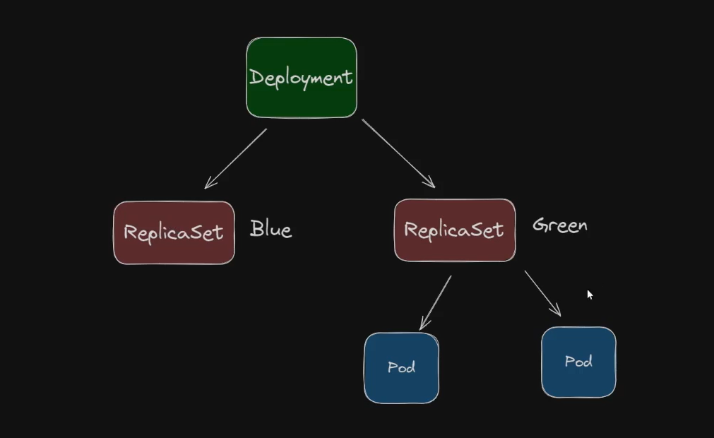

# Deployment

Manages many Replicasets

I had changed the version of my PODS from Blue to Green. But this change was not reflected in my replicaset. Because the replicaset does not update the version, that's why we need the deployment to make this change automatically. I would have to delete my PODS so that they could be recreated with the new version; it would be very painful. It would take a long time to do this manually, but it can be done automatically with deployment.

PT

eu tinha mudado as a versão dos meus PODS para de Blue para Green.. mas essa alteração não foi refletida no meu replicaset por quê Porque o replicaset  não atualiza versão, por isso que nós precisamos do deployment para fazer essa alteração automática. eu teria que deletar os meus PODS para que eles fossem recriados com a nova versão você seria muito doloroso.  Eu demoraria muito para fazer isso manualmente mas dá para fazer automaticamente com deployment.




```powershell

kubectl delete -f replicaset.yaml

kubectl get rs

kebectl get all

kubeclt apply -f deployment.yaml


# mapping the port
kubectl port-forward mydeployment-54d6d7db5b-7nqq8  8080:80

# watch

kubectl apply -f replicaset.yaml; while ($true) {Clear-Host; kubectl get po; Start-Sleep -Seconds 2}


```